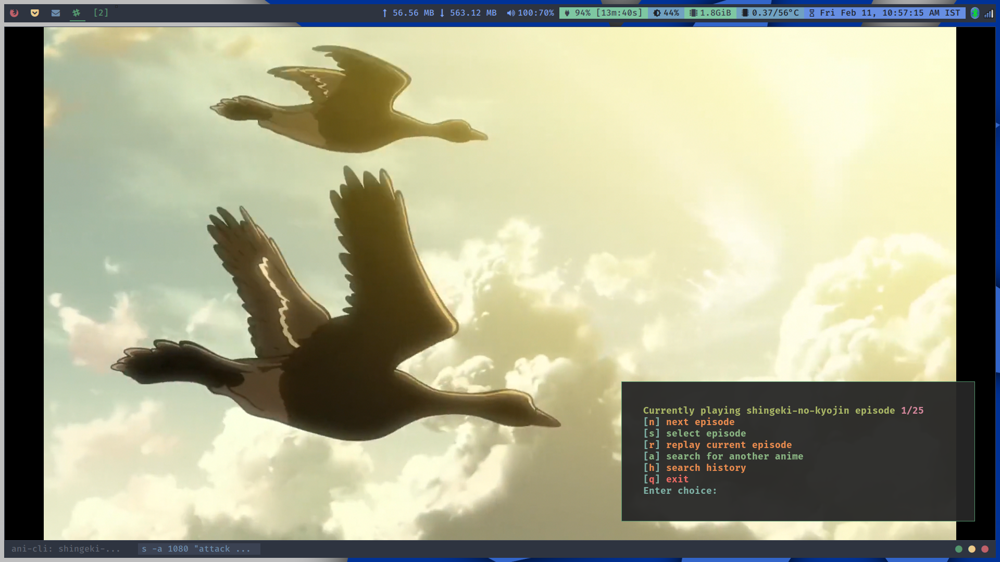
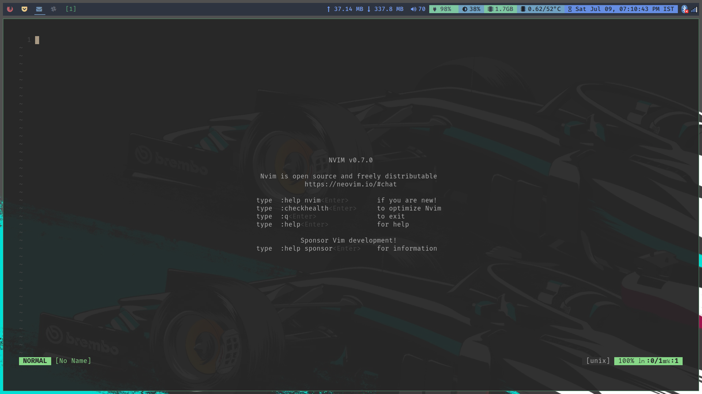
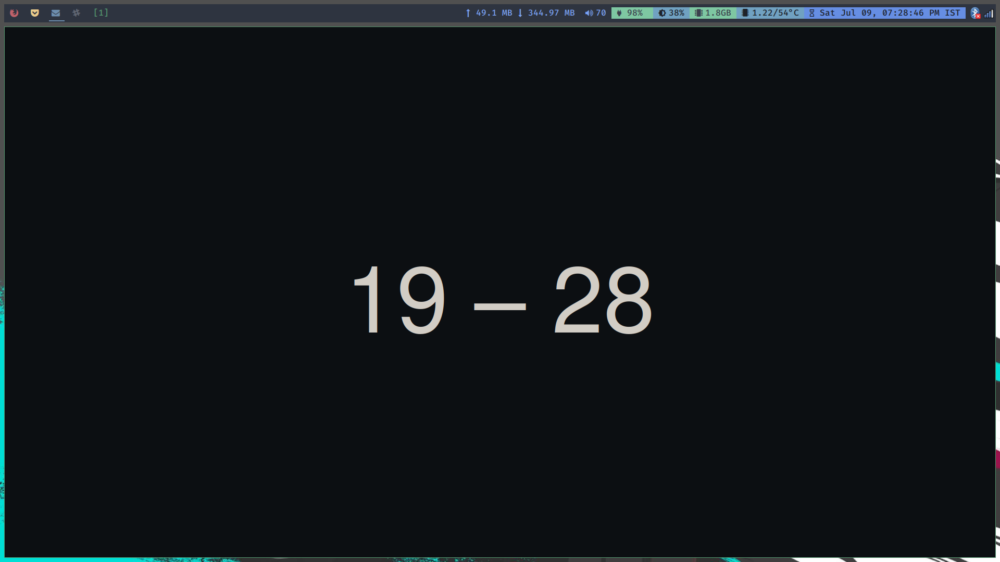
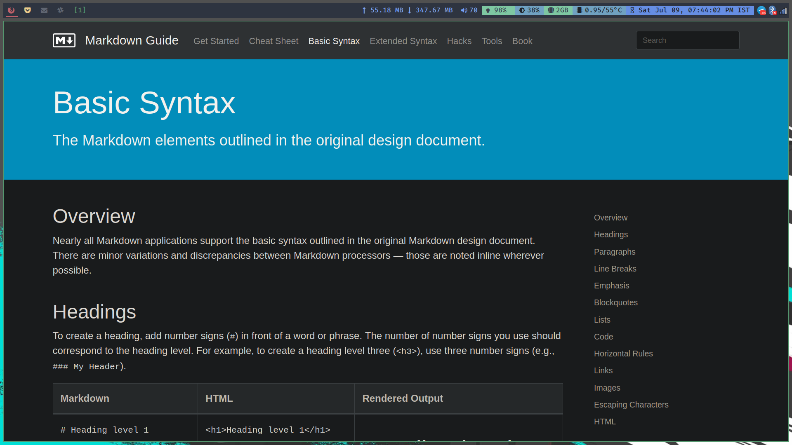

# Making rm -rf ~/.* / pretty much useless 😅

- Screenshots:

    > **O.S. :** NixOS,
    > **W.M. :** DWM,
    > **Bar  :** DwmBlocks 

    > **ani-cli**
    > 

    > **Nvim**
    > 

    > **Firefox**
    > 
    > 

